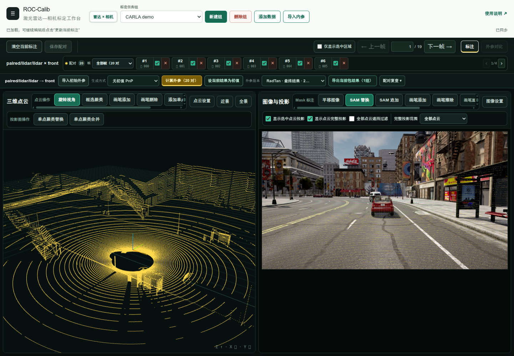

# ROC-Calib

**Camera–LiDAR Calibration from Operator-Confirmed Regions**

[中文](README_zh-CN.md) · [Usage](docs/usage.md) · [Data format](docs/data.md) · [Results](docs/results.md)

Select the same objects in an image and a point cloud. ROC-Calib estimates the camera–LiDAR transform from these region pairs, without a calibration target or a supplied initial pose. SAM2 can help draw image masks.



## Try the solver

Python 3.12, Linux. The saved-pair example runs on CPU; it does not need SAM2 or a running website.

```bash
git clone https://github.com/zhangtingyu11/ROC-Calib.git
cd ROC-Calib
python3 -m venv .venv
source .venv/bin/activate
pip install -r requirements.lock -e .
python tools/download_demo.py
roc-calib demo/carla/request.json --initial demo/carla/initial.json \
  --output outputs/carla.json --verify demo/carla/expected.json
```

The example uses 20 frozen object pairs from 19 full-density CARLA frames. Its initial pose was computed from object correspondences. Omit `--initial` to compute a new PnP initialization.

The output contains a row-major 4×4 matrix: `p_camera = T_camera_from_lidar @ p_lidar`. Translation is in meters.

## Open the workbench

Docker with NVIDIA Container Toolkit:

```bash
./start.sh
```

Open **http://localhost:3000**. Create a group, add paired images and clouds, select matching object regions, then click **计算外参** (Calibrate). See the [illustrated workflow](docs/usage.md).

```bash
./start.sh --cpu                         # CPU-only, including segmentation
ROC_CALIB_PORT=3002 ./start.sh           # use another port
```

Data stays in `./data`. The server binds to localhost by default. [Installation and remote access](docs/install.md).

## Results

| Configuration | Groups | Object pairs | Mean rotation error | Mean translation error |
| --- | ---: | ---: | ---: | ---: |
| ROC-Calib region objective | 10 | 220 | 0.284° | 4.90 cm |

Equal mean over ten fixed annotation groups. These numbers describe the frozen observations, not an independent repeat of manual annotation. The workbench uses the same region objective and acceptance protocol. [Per-group results and reproduction](docs/results.md).

## Citation

```bibtex
@software{roc_calib_2026,
  author = {{ROC-Calib contributors}},
  title = {ROC-Calib: Camera--LiDAR Calibration from Operator-Confirmed Regions},
  year = {2026},
  url = {https://github.com/zhangtingyu11/ROC-Calib}
}
```

## License

[MIT](LICENSE). External models and datasets retain their own licenses. [Third-party notices](NOTICE.md).
